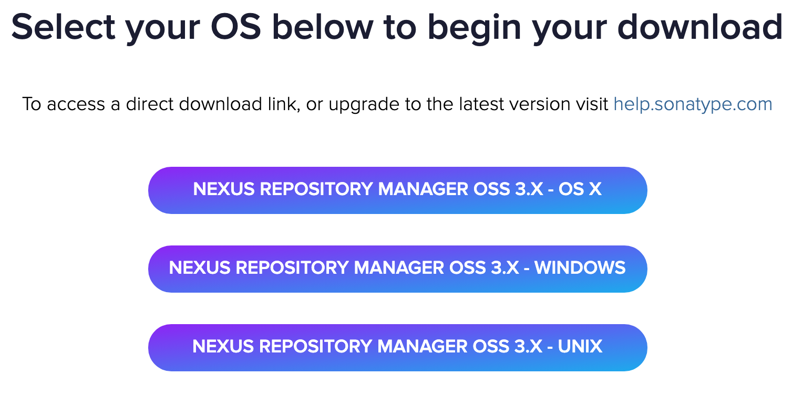
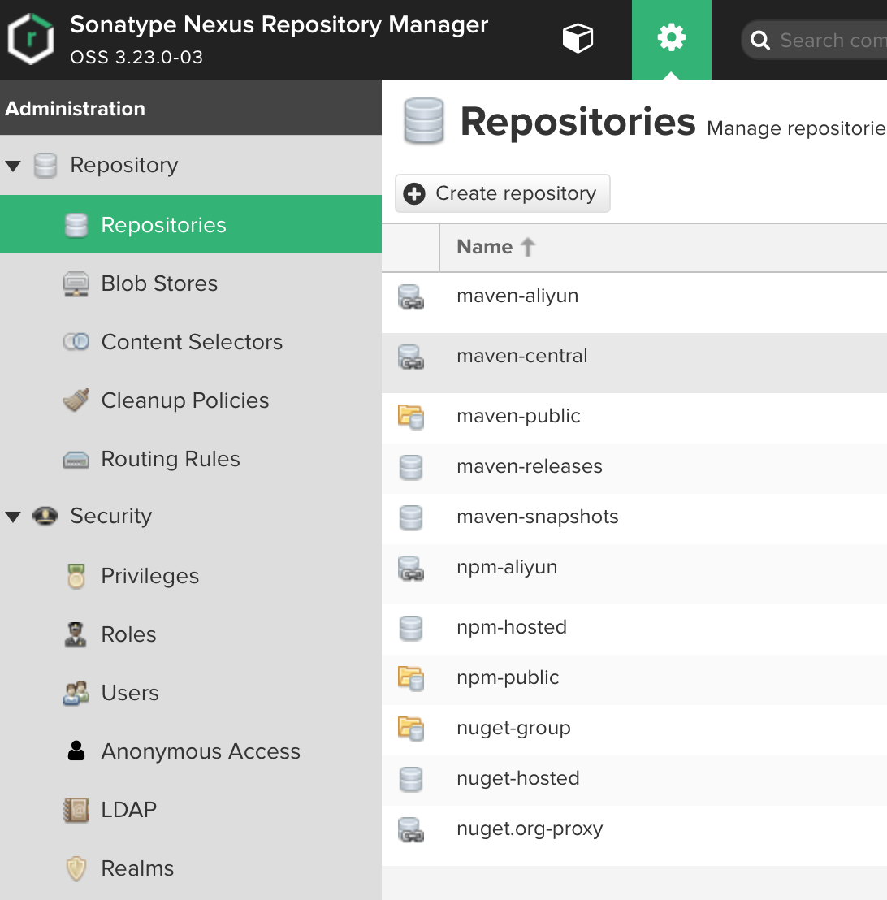
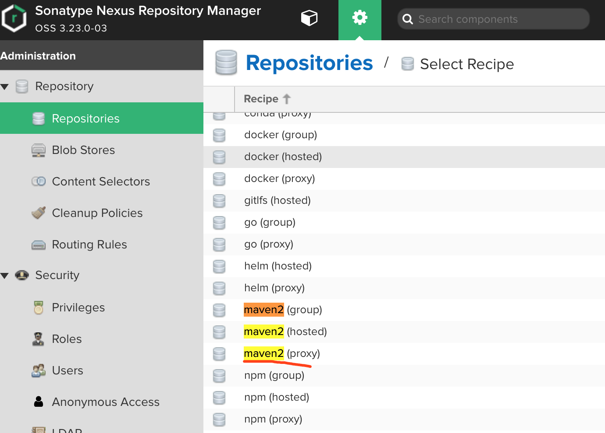
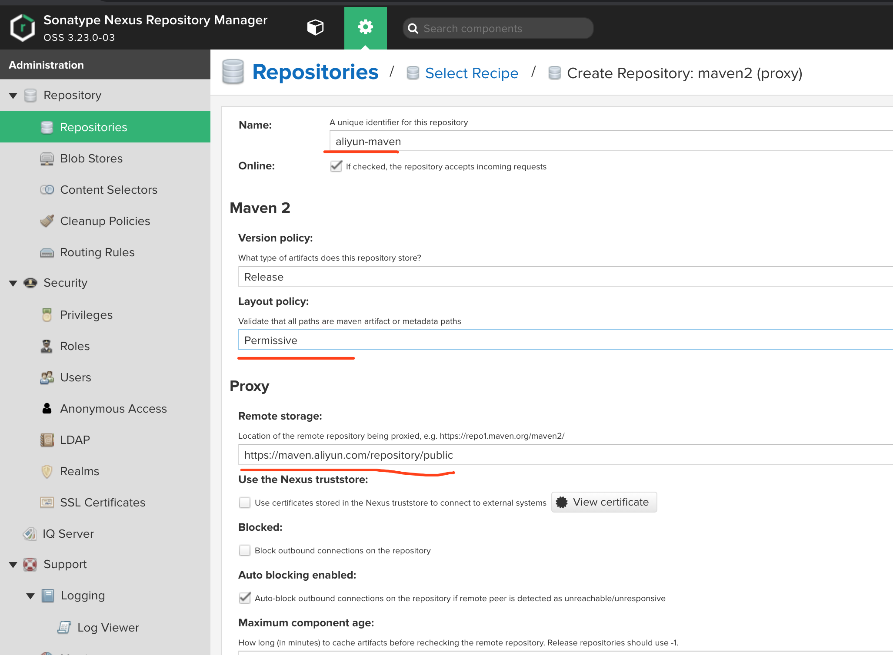
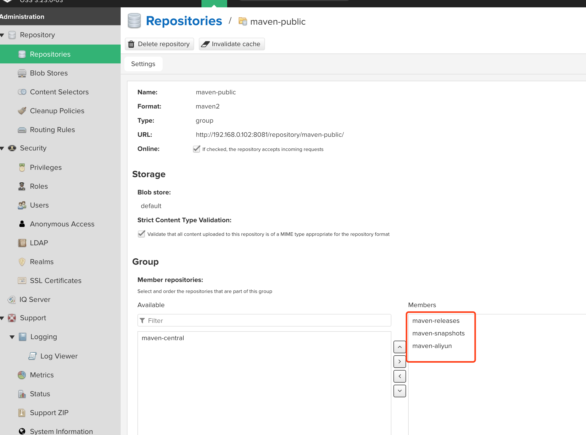
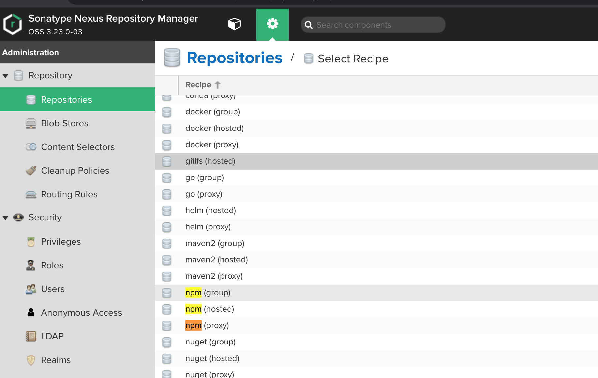
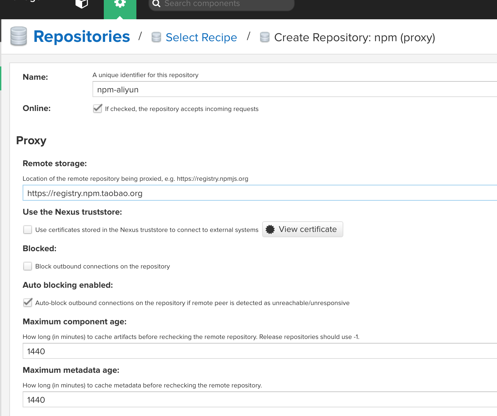
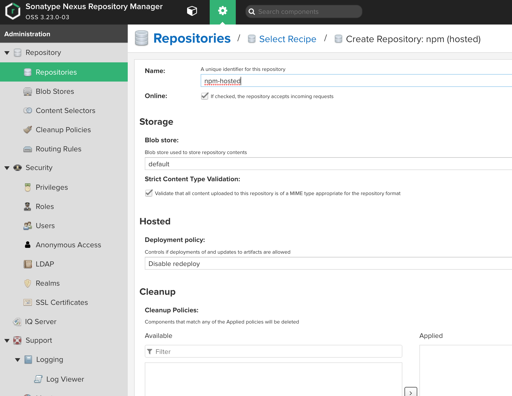
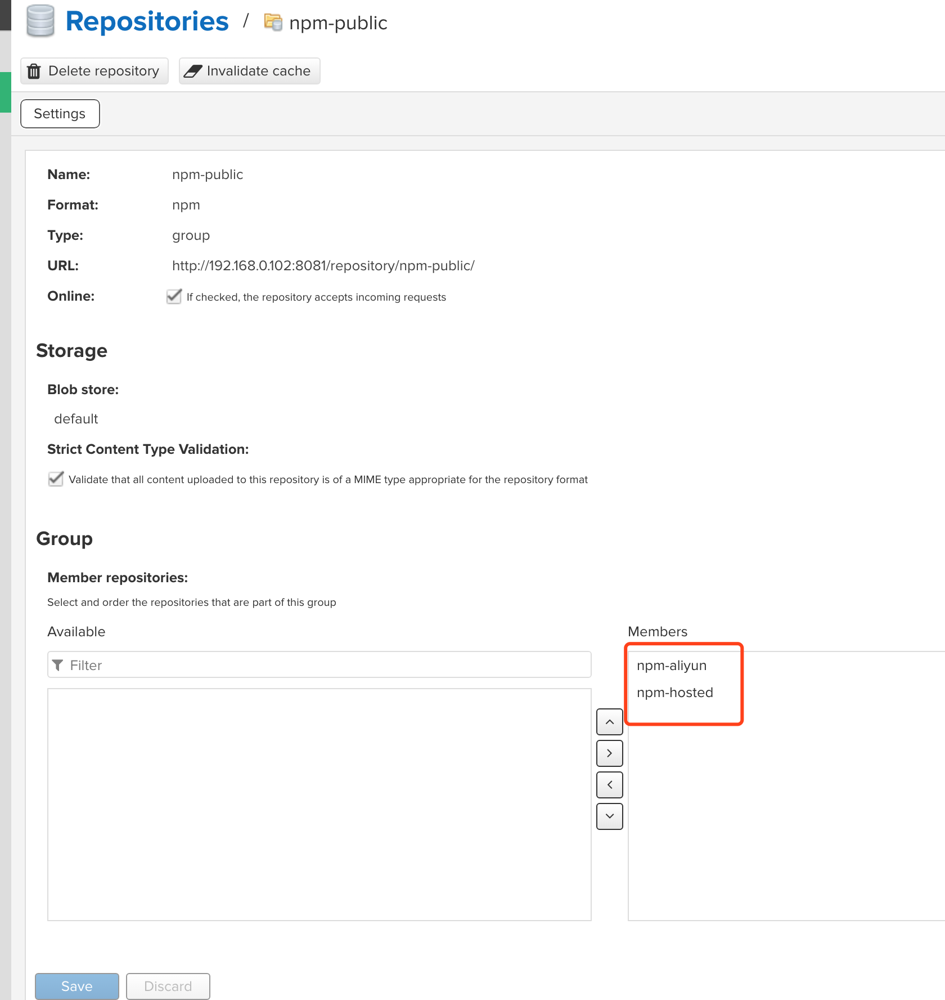
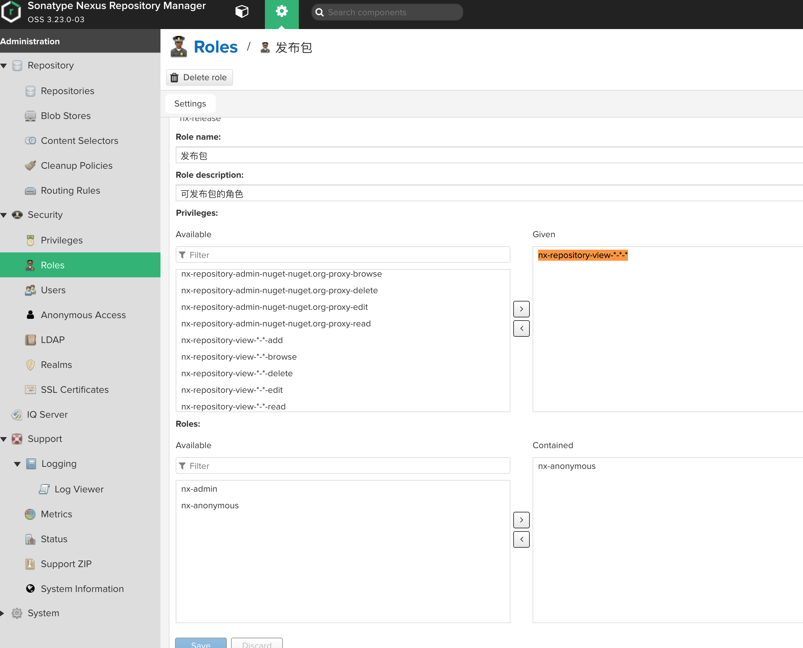

# Nexus私服搭建

## 1 下载最新安装包

```sh
https://www.sonatype.com/download-oss-sonatype
```

填写邮箱，选择No 进入下载页面。



选择对应的环境下载，我这里选择的是WINDOWS。


## 2 运行

解压缩，管理员运行 powershell 进入 nexus-3.23.0-03/bin 目录

```shell
-- 进入nexus-3.23.0-03/bin目录
cd nexus-3.23.0-03/bin

-- 进行安装, 成功后会提示 Installed service 'nexus' 
-- 如果提示 could not open SCManager 是因为没有使用管理员身份启动powershell
nexus.exe /install

-- 运行服务，第一次启动时间需要久一点
nexus.exe /run
```


## 3 设置Nexus

### 3.1 进入系统 修改密码

进入系统 http://192.168.0.102:8081 点击右上角`Sign In`

输入admin 密码为 sonatype-work/admin.password 文件的字符串，进入会提示修改密码，按提示修改密码。


### 3.2 设置Repository

### 3.2.1 添加Maven仓库

进入到 repositories，添加阿里云远程代理。







选择maven2(proxy) ，URL填写 https://maven.aliyun.com/repository/public





进入maven-public，选择仓库的顺序。




### 3.2.2 NPM仓库

分别添加npm(group)表示分组，npm(hosted)表示本机私有，npm(proxy)表示远程代理。

**若registry配置为group(包括hosted和proxy)，首先会从hosted取，若无则从proxy取并缓存，下次则会从缓存取。**

- 点击Create repository按钮创建仓库

- 选择 `npm(proxy)`, 输入 Name: npm-proxy, remote storage 填写  https://registry.npm.taobao.org  或 https://registry.npmjs.org 用于将包情求代理到地址地址，此处我填写的https://registry.npm.taobao.org 因为国内 使用这个会加速。

  






- 添加npm(hosted)




- 添加npm(group)分组




## 4 Maven部署代码库到私服

### 4.1 配置maven的setting.xml文件

- 配置mirrors

```xml
    <mirrors>
        <mirror>
            <id>mynexus</id>
            <name>mynexus</name>
            <url>http://192.168.0.102:8081/repository/maven-public/</url>
            <mirrorOf>*</mirrorOf>
        </mirror>
    </mirrors>
```

- 配置servers的发布账号，此处的账号需要拥有nx-repository-view-*-*-*权限。

```xml
    <servers>
        <server>
            <id>nexus-releases</id>
            <username>nexus的用户</username>
            <password>密码</password>
        </server>
        <server>
            <id>nexus-snapshots</id>
            <username>nexus的用户</username>
            <password>密码</password>
        </server>
    </servers>      
```



- 设置项目pom.xml

```xml
<!--管理构件的发布 定义snapshot快照仓库和release发布仓库。snapshot快照仓库用于保存开发过程中的不稳定版本，release正式仓库则是用来保存稳定的发行版本-->
<distributionManagement>
    <repository>
        <id>nexus-releases</id>
        <name>Nexus Release Repository</name>
        <url>http://192.168.0.102:8081/repository/maven-releases/</url>
    </repository>
    <snapshotRepository>
        <id>nexus-snapshots</id>
        <name>Nexus Snapshot Repository</name>
        <url>http://192.168.0.102:8081/repository/maven-snapshots/</url>
        <uniqueVersion>true</uniqueVersion>
    </snapshotRepository>
</distributionManagement>
```

- 将源代码一起部署到nexus上（可选，视情况需要）

```xml
<!-- 要将源码放上去，需要加入这个插件 -->
<plugin>
    <artifactId>maven-source-plugin</artifactId>
    <version>3.0.1</version>
    <configuration>
        <attach>true</attach>
    </configuration>
    <executions>
        <execution>
            <phase>compile</phase>
            <goals>
                <goal>jar</goal>
            </goals>
        </execution>
    </executions>
</plugin>
```


- 发布代码库到nexus

```shell
mvn clean deploy -DskipTests
```


## 5 参考文档

1. https://www.jianshu.com/p/1674a6bc1c12